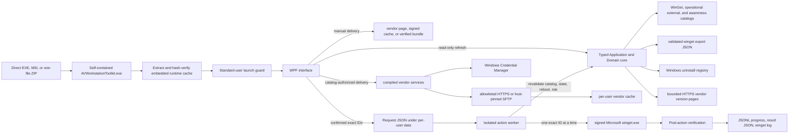

# AV Workstation Toolkit 1.1.1 Architecture and Safety Model

## Design goal

AV Workstation Toolkit provides a straightforward package-selection experience while retaining a narrow, auditable execution boundary. The interface is local WPF rather than a hosted page because installation must remain on the workstation and should not expose a local or remote HTTP command surface.

## Components

| Component | Responsibility |
|---|---|
| `src/AVWorkstationToolkit.Launcher` | Self-contained compiled-WPF bootstrap, embedded-runtime extraction/integrity repair, canonical per-user data root, embedded-worker identity, and retired-runtime cleanup |
| `src/AVWorkstationToolkit.App` | Production WPF presentation, typed refresh/filter/selection state, action coordination, vendor handoffs, and diagnostics |
| `src/AVWorkstationToolkit.Application` / `Domain` | Production use cases, strict requests/IPC, catalog/planning/authority, and typed policy |
| `src/AVWorkstationToolkit.Infrastructure.Windows` | Trusted WinGet/registry/reboot/process/file/vendor/credential/Authenticode Windows adapters |
| `src/AVWorkstationToolkit.Worker` | Independent standard-user worker, per-package reauthorization, exact-ID WinGet execution, progress/results/cancellation, and fresh verification |
| `installer/` | Per-machine x64 MSI, Program Files deployment, upgrade handling, and Start-menu lifecycle |
| `Build-AVWorkstationToolkit.cmd` / `build/Build-Release.ps1` | Fresh-clone entry point, version agreement, source QA, locked dependency audit, standalone launcher publish, explicit RFC3161 signing policy, EXE/MSI/ZIP/notices/SBOM/provenance output, optional verified offline bundle/Defender scan, and manifest-covering checksums |
| `app/AVWorkstationToolkit.xaml` | Legacy presentation characterization fixture; not packaged |
| `scripts/Start-AVWorkstationToolkit.ps1` | Legacy UI/controller characterization fixture; not packaged |
| `scripts/AVWorkstationToolkit.Vendor.psm1` | Legacy vendor-boundary characterization fixture; not packaged |
| `manifests/managed-applications.json` | Production exact-ID WinGet allowlist, profiles, risks, holds, and forbidden-product pattern |
| `manifests/external-applications.json` | Operational external detection, known versions, bounded vendor release checks, parent relationships, and delivery policy |
| `catalog/vendors/*.json` | Authoritative per-manufacturer source records for broad awareness metadata |
| `build/Compile-CommercialCatalog.ps1` | Strict UTF-8 source compilation, normalization, duplicate checks, policy invariants, and compiled-artifact drift detection |
| `manifests/commercial-av-catalog.json` | Deterministically compiled, embedded, non-deployable commercial AV metadata for role, discipline, lifecycle, licensing, access, platform, and system impact |
| `manifests/process-launch-policy.json` | Embedded regression contract for every process category AV Workstation Toolkit intentionally starts; descriptive only and never an execution-authority input |
| `scripts/Add-AVWorkstationToolkitExternalPackage.ps1` | Explicit redistribution gate plus payload hash and signer capture for authorized offline bundles |
| `scripts/AVWorkstationToolkit.Core.psd1` / `.psm1` | Legacy behavioral characterization oracle and repository tooling; not packaged |
| `scripts/Invoke-AVWorkstationToolkitAction.ps1` | Legacy worker characterization fixture; not packaged |
| `tests/Run-Tests.ps1` / `Test-EndpointTrust.ps1` | Dependency-free non-installing regression, process-policy, packaging-pattern, and optional Defender release checks |

## Compiled production runtime

WPF remains the local Windows desktop shell; no web service or generic command surface was introduced. Compiled Domain/Application policy, WPF presentation, Windows providers, vendor services, request/IPC, and the independent compiled worker are production-authoritative. Provider transport supplies facts or a permitted handoff but never grants deployment authority. Vendor source records still compile into one embedded artifact rather than mutable runtime inputs.

The old PowerShell/WPF runtime, PowerShell worker, and launcher vendor bridge are retired from shipping. There is no legacy runtime switch or automatic fallback. On startup the launcher may delete only an exact allowlist of stale extracted runtime files left by a prior version; unrecognized data is never removed.

The normal endpoint process tree, file/registry/network behavior, false-positive response, and ranked future compiled-runtime candidates are documented in [Endpoint-Security-Behavior.md](Endpoint-Security-Behavior.md).

## Defense in depth

1. The UI presents only IDs returned by the validated catalog.
2. A request contains an action and exact IDs, not arbitrary command-line text.
3. Production compiled App and worker refuse elevation.
4. `winget.exe` must resolve from the Microsoft Desktop App Installer package beneath protected `Program Files\WindowsApps` storage and pass Microsoft Authenticode verification.
5. Runtime files are compile-time embedded resources. On every launch, the executable rejects invalid or duplicate resource paths and reparse-point cache paths, restores missing or altered files, and verifies extracted SHA-256 hashes before the compiled App can use the worker or catalogs.
6. Mutable package requests and evidence are separated from installed files under `%LOCALAPPDATA%\AVWorkstationToolkit`; source checkouts retain repository-local data for development.
7. Request files must be direct, non-reparse-point children of the resolved `logs\requests`, use the required filename, size, and versioned JSON schema, and contain no unknown fields.
8. The worker rebuilds a live plan and revalidates every ID; during a multi-package run it refreshes state before every package after the first.
9. An explicit Windows Update or Component Based Servicing reboot is always surfaced. It blocks driver-, service-, and listener-bearing packages at shared request validation, while ordinary low-risk applications may continue. A newly detected reboot is reevaluated before the next package. Generic queued file cleanup is not a reboot signal.
10. Manual deployment and maintenance holds cannot be bypassed by the interface.
11. Driver, service, and listener risk requires a second, run-specific acknowledgement.
12. winget is invoked with `--id`, `--exact`, and `--source winget` for one package at a time.
13. The execution path contains no `--all`, `winget import`, or uninstall operation.
14. Each successful native command is post-verified before being reported as succeeded.
15. External applications are permanently excluded from worker requests; they remain manual even when AV Workstation Toolkit reports a newer version.
16. Vendor release checks accept only catalogued credential-free HTTPS URIs, bounded responses, timeout-limited regexes, and numeric versions. Failure retains the embedded baseline and is reported.
17. A bundled third-party file is exposed only after its path remains beneath `packages`, contains no reparse point, and matches the hash and optional Authenticode publisher embedded in AVWorkstationToolkit.
18. Offline package authoring requires an explicit redistribution-rights assertion, and the local payload depot is excluded from Git.
19. Direct downloads accept only a version-matched URI from the embedded page pattern, recheck every HTTPS redirect against the host allowlist, enforce a size cap, and remain temporary until Authenticode publisher validation succeeds.
20. The SFTP catalog prohibits DTDs, requires the complete product-ID allowlist, constrains version-matched `.exe` paths beneath the embedded remote root, and bounds the selected product size.
21. The SFTP bridge observes the server host key before sending credentials. First use and replacement require explicit UI approval; authentication and downloads use a fixed-time comparison with the trusted SHA-256 fingerprint.
22. SFTP passwords cross the process boundary only through redirected standard input. Saving occurs only after successful authentication, uses a Windows generic credential scoped by host, port, and username, and can be explicitly forgotten.
23. Downloaded vendor payloads remain outside the action worker. Their per-user cache path rejects reparse points, records SHA-256 metadata, and rechecks both hash and Authenticode publisher before reuse or Explorer handoff.
24. Schema 3 metadata uses validated vocabularies and explicit unknowns. Licensing, access, lifecycle, platform, and system impact cannot be smuggled into uncontrolled fields or interpreted as deployment approval.
25. `Awareness` rows and records with no Windows detection mode can be searched and linked to official pages but can never become install/update actions.
26. A `ParentProvider` child must reference an existing authenticated provider and one product in its allowlist. Host, feed, remote root, size, and publisher controls are inherited; independent child credentials are impossible.

Catalog validation fails closed on missing fields, duplicate IDs, unknown profiles/risks, and product terms matching the security/management exclusion pattern.

## State model

The core obtains installed-package identity and installed versions from `winget export --include-versions`, validates the JSON schema fields AV Workstation Toolkit consumes, and deletes the unique temporary export in a `finally` block. Installation eligibility therefore does not depend on console-table widths or display truncation. If WinGet warns that an otherwise-absent catalog package could not be mapped to its source, the plan also fails closed instead of treating the omission as permission to install another copy. Available updates still come from the read-only `winget list --upgrade-available` command; a failed, empty, or truncated update result marks every package as `Error` and leaves the plan unselectable. The interface never infers that an app is current from a failed update query.

External providers are evaluated independently so a vendor-site outage cannot weaken or block WinGet state. Uninstall inventory tracks HKLM 64-bit, HKLM 32-bit, and HKCU reliability separately: successful sources remain usable, an unmatched detector under partial coverage reports `InventoryIncomplete`, and complete source loss reports `InventoryUnavailable`. A malformed version affects only its matching package. AV Workstation Toolkit reads only uninstall-registry display names and versions matched by embedded patterns. A refresh optionally reads a catalogued vendor page and extracts one named numeric version from at most 2 MiB of content; inventory-only providers perform no release comparison. Parent-provider children resolve through the parent's single curated feed. Manual, inventory-warning, and awareness rows are never selectable. The delivery button may open an embedded HTTPS vendor URL, invoke a signed direct download, open the curated authenticated-SFTP picker, or show a verified bundled/cached file. None of these paths submit an action-worker request or execute an installer.

The 281-record compiled awareness manifest is intentionally outside the operational provider boundary. Records may represent Windows tools, built-in Windows capabilities, macOS/mobile software, servers, web services, embedded firmware, or diagnostic interfaces. A record with registry evidence can report `Inventory` or `NotDetected`; a record without a Windows detection mode reports `Awareness`. Both remain non-actionable. The authoritative vendor source files are build inputs only; AV Workstation Toolkit embeds and consumes the single normalized artifact. The full state and metadata design is documented in [Commercial-AV-Catalog.md](Commercial-AV-Catalog.md).

The action worker is a separate standard-user compiled .NET process. Closing the UI does not terminate an active installer. Cancellation is cooperative between packages, which avoids leaving an installer half-applied. Installers that require administrator rights request UAC themselves; AV Workstation Toolkit does not preload user-writable repository code into an elevated process.

## Evidence and privacy

WinGet writes installed-package JSON to a uniquely named file beneath the OS temporary directory; AV Workstation Toolkit validates it, retains only package IDs and versions in memory, and deletes the file immediately. Exported plans retain only catalogued app status and versions. Worker output is stripped of terminal controls and obvious credential-like values before it reaches progress or winget logs. The read-only Diagnostics surface reports runtime and subsystem health without usernames, computer names, raw registry records, or credential-store values, and applies the same sensitive-text redaction before copy/export. SFTP passwords are not logged or exported and saved passwords are owned by Windows Credential Manager, while trusted host fingerprints and verified download hashes remain under the per-user data root. Packaged logs, reports, snapshots, and cached installers live beneath `%LOCALAPPDATA%\AVWorkstationToolkit`; they can still include paths and package metadata and remain sensitive local operational evidence.

## Known limitations

- The tool relies on winget source metadata and package publishers. An upstream manifest or asset can become stale, as seen with RealVNC and tftpd64; both are held from automated maintenance until their package sources are independently verified.
- It is not a general package repository, software-signing service, credential broker, MDM platform, or privilege-management system. Offline bundles are finite, locally authored delivery sets with pinned payloads, and authenticated SFTP still requires the user's vendor account and license rights.
- Installer UAC prompts and package-specific UI remain possible.
- There is no automatic rollback. Failure is logged and requires package-specific review.
- A local administrator can alter Program Files content, and a same-user process can alter the per-user runtime cache. The next launch repairs cache drift from the embedded executable, but this is not a substitute for trusted code signing of the executable itself.
- The build supports Authenticode signing, but a trusted organization certificate is not stored in this repository. Unsigned CI artifacts are release candidates, not organization-authenticated binaries.
- Vendor-managed software cannot be bundled unless the distributor has explicit rights. Q-SYS remains vendor-page-only because its current EULA restricts external distribution.
- Vendor page layouts, account portals, SFTP keys, and Authenticode identities can change. AV Workstation Toolkit fails closed when an embedded pattern or trust rule no longer matches; the catalog must be reviewed rather than weakened at runtime.
- Catalog metadata is a dated research snapshot, not an entitlement or compatibility guarantee. Project files, device firmware, vendor accounts, licenses, and supported operating systems must be rechecked before onsite use.

The complete finding register and residual-risk statement are in [AV Workstation Toolkit Security Audit](AV-Workstation-Toolkit-Security-Audit.md).

## Official implementation references

- Microsoft documents `winget list --upgrade-available` for read-only update discovery: <https://learn.microsoft.com/windows/package-manager/winget/list>
- Microsoft documents the JSON `winget export` format and `--include-versions`: <https://learn.microsoft.com/windows/package-manager/winget/export>
- Microsoft winget command behavior and noninteractive options: <https://learn.microsoft.com/windows/package-manager/winget/>
- Microsoft winget troubleshooting and return codes: <https://learn.microsoft.com/windows/package-manager/winget/troubleshooting>
- Microsoft WPF and XAML application model: <https://learn.microsoft.com/dotnet/desktop/wpf/overview/>
- Q-SYS Designer Software releases, including the current LTS channel: <https://www.qsys.com/products-solutions/q-sys/software/q-sys-designer-software/>
- Q-SYS 9.13 software terms and redistribution restrictions: <https://help.qsys.com/q-sys_9.13/Content/Legal.htm>
- Microsoft Windows Credential Manager APIs: <https://learn.microsoft.com/windows/win32/api/wincred/>
- SSH.NET package and supported SFTP/password-authentication targets: <https://www.nuget.org/packages/SSH.NET>
- Crestron MasterInstaller operation: <https://docs.crestron.com/en-us/9450/Content/Master%20Installer.htm>
